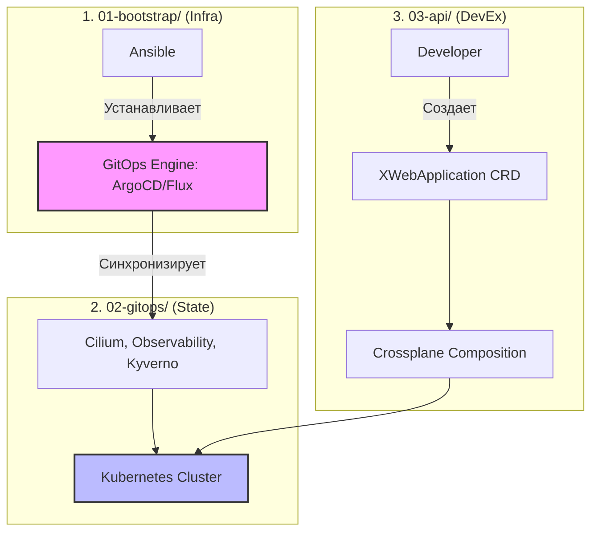

# Kubernetes Platform Engineering Blueprint

[](https://kubernetes.io/)
[](https://www.ansible.com/)
[](https://argoproj.github.io/)
[](LICENSE)

Эталонная архитектура (Blueprint) для построения внутренней платформы разработчиков (Internal Developer Platform, IDP) на базе Kubernetes с использованием лучших практик Platform Engineering 2026 года.

## Project Goals

✔ Production-ready  
✔ Enterprise-ready  
✔ GitOps-first  
✔ Immutable Infrastructure  
✔ Security-first (Supply Chain)  
✔ Platform Engineering  
✔ Multi-cluster  
✔ Declarative  
✔ Extensible (driver model)

---

## 🏗 Архитектура

Платформа **логически разделена на три независимые области ответственности**. В данном проекте они объединены в один monorepo с явной нумерацией для упрощения разработки, сопровождения и демонстрации архитектуры.



**Подробная архитектура**: [docs/architecture.md](docs/architecture.md)

---

## 📸 Screenshots

### ArgoCD UI после bootstrap
<!-- TODO: Замените на реальный скриншот после развертывания -->


### Структура кластера после развертывания
<!-- TODO: Замените на реальный вывод kubectl -->


---

## 🚀 Quick Start

### 1. Подготовка
```bash
cd 01-bootstrap
pip install ansible kubernetes
ansible-galaxy collection install -r requirements.yml
```

### 2. Настройка inventory
Отредактируйте `01-bootstrap/inventory/production/hosts.ini` и `01-bootstrap/inventory/production/group_vars/all.yml`:
```yaml
kubernetes:
  kubeconfig: ~/.kube/config

gitops:
  engine: argocd  # или 'flux'
  version: "7.5.0"
  namespace: gitops-system
  repo_url: "https://github.com/your-org/k8s-platform.git"
  revision: "main"
  path: "02-gitops/bootstrap/root"
```

### 3. Запуск bootstrap
```bash
ansible-playbook playbooks/bootstrap.yml
```

**Готово!** ArgoCD установлен и автоматически синхронизирует компоненты из `02-gitops/`.

---

## 📂 Структура проекта

```text
k8s-platform/
├── 01-bootstrap/          # Шаг 1: Ansible для установки GitOps-движка
├── 02-gitops/             # Шаг 2: Декларативное состояние платформы
├── 03-api/                # Шаг 3: Crossplane XRD/Composition для разработчиков
├── docs/                  # Документация и ADR
└── examples/              # Примеры использования Platform API
```

### `01-bootstrap/`
**Шаг 1**: Ansible-код для первоначального развертывания кластера и установки GitOps-движка.
- **Драйверная модель**: поддержка ArgoCD, Flux, Fleet через `include_tasks`
- **Идемпотентность**: безопасные повторные запуски
- **OCI-first**: предпочтительная загрузка Helm-чартов из OCI-реестров

**Подробности**: [docs/bootstrap.md](docs/bootstrap.md)

### `02-gitops/`
**Шаг 2**: Декларативное состояние платформы, управляемое ArgoCD/Flux.
- **Компоненты**: Cilium, Observability (OTel + Prometheus + Pyroscope), Kyverno
- **Git Generator**: ApplicationSet автоматически находит все компоненты
- **Multi-cluster**: разделение `components/` и `clusters/`
- **Supply Chain Gate**: Syft, Grype, Trivy, Conftest в CI

**Подробности**: [docs/gitops.md](docs/gitops.md)

### `03-api/`
**Шаг 3**: Интерфейс для разработчиков на базе Crossplane.
- **XRD**: абстракции высокого уровня (например, `XWebApplication`)
- **Composition Functions**: декларативная генерация ресурсов
- **Без Go-кода**: 95% сценариев покрываются Composition Functions

---

## 👨‍💻 Developer Experience

Разработчикам не нужно знать о Kubernetes-примитивах. Они взаимодействуют только с Platform API.

**Пример запроса от разработчика** (`examples/webapp-claim.yaml`):
```yaml
apiVersion: platform.company.io/v1alpha1
kind: XWebApplication
metadata:
  name: my-awesome-app
spec:
  image: ghcr.io/myorg/myapp:v1.2.3
  domain: myapp.dev.company.com
  replicas: 3
```

**Что происходит дальше**:
1. Crossplane Composition Functions читает `XWebApplication`
2. Автоматически генерирует `Deployment`, `Service`, `HTTPRoute`
3. Разработчик получает работающее приложение по указанному домену

---

## 🛡️ Security & Compliance

Каждый Pull Request в `02-gitops/` проходит автоматическую проверку:

1. **Syft** — генерация SBOM (SPDX format)
2. **Grype** — сканирование уязвимостей в SBOM
3. **Trivy** — статический анализ конфигураций
4. **Conftest/OPA** — проверка организационных политик

**Подробности**: [docs/security.md](docs/security.md)

---

## 📚 Документация

- **[Архитектура](docs/architecture.md)** — полная схема платформы
- **[Bootstrap](docs/bootstrap.md)** — детали Ansible-ролей и драйверной модели
- **[GitOps](docs/gitops.md)** — структура компонентов и multi-cluster
- **[Security](docs/security.md)** — Supply Chain Security
- **[ADR](docs/adr/)** — Architectural Decision Records

---

## 🔧 Технологический стек

| Слой | Технологии |
| :--- | :--- |
| **Infrastructure** | Ansible, Helm |
| **GitOps Engine** | ArgoCD (или Flux) |
| **Networking** | Cilium (CNI + eBPF LB + Gateway API + Hubble) |
| **Observability** | OpenTelemetry, Prometheus, Loki, Tempo, Pyroscope |
| **Policy** | Kyverno, OPA/Conftest |
| **Platform API** | Crossplane (Composition Functions) |
| **Supply Chain** | Syft, Grype, Trivy, Sigstore/Cosign |

---

## 📜 Architectural Decision Records (ADR)

Все ключевые архитектурные решения задокументированы в [docs/adr/](docs/adr/):

- [ADR-0001: Monorepo Structure](docs/adr/0001-monorepo-structure.md)
- [ADR-0002: GitOps Driver Model](docs/adr/0002-gitops-driver-model.md)
- [ADR-0003: Cilium Preference](docs/adr/0003-cilium-preference.md)
- [ADR-0004: Grafana Separation](docs/adr/0004-grafana-separation.md)
- [ADR-0005: Crossplane Functions over Go Controllers](docs/adr/0005-crossplane-functions.md)

---

## 🤝 Contributing

1. Форкните репозиторий
2. Создайте ветку фичи (`git checkout -b feature/amazing-feature`)
3. Убедитесь, что `ansible-playbook --syntax-check` и `conftest test` проходят
4. Создайте Pull Request

---

## 📄 Лицензия

MIT License. См. [LICENSE](LICENSE).

---

## 🎓 Для кого этот проект

Этот blueprint предназначен для:
- **Platform Engineers**, которые хотят построить современную Kubernetes-платформу
- **DevOps Engineers**, изучающих GitOps и Platform Engineering
- **Архитекторов**, ищущих reference architecture для enterprise-сред
- **Разработчиков**, желающих понять, как устроена внутренняя платформа

---

> **Примечание**: Этот проект является живым документом. Архитектура будет эволюционировать вместе с экосистемой Kubernetes и лучшими практиками Platform Engineering.
```

---

# 📂 Все файлы проекта с обновленными путями

## `01-bootstrap/ansible.cfg`
```ini
[defaults]
inventory = inventory/production/hosts.ini
roles_path = roles
collections_path = collections
retry_files_enabled = false
stdout_callback = yaml
callback_whitelist = timer, profile_tasks
forks = 10
timeout = 60
host_key_checking = false

[privilege_escalation]
become = true
become_method = sudo
```

## `01-bootstrap/requirements.yml`
```yaml
---
collections:
  - name: kubernetes.core
    version: ">=3.0.0"
  - name: community.general
    version: ">=8.0.0"
```

## `01-bootstrap/inventory/production/hosts.ini`
```ini
[k8s_control_plane]
k8s-master-01 ansible_host=192.168.1.10

[k8s_workers]
k8s-worker-01 ansible_host=192.168.1.11
k8s-worker-02 ansible_host=192.168.1.12

[k8s_nodes:children]
k8s_control_plane
k8s_workers

[k8s_nodes:vars]
ansible_user=ubuntu
ansible_ssh_private_key_file=~/.ssh/id_rsa
```

## `01-bootstrap/inventory/production/group_vars/all.yml`
```yaml
---
kubernetes:
  kubeconfig: /etc/rancher/rke2/rke2.yaml

gitops:
  engine: argocd
  version: "7.5.0"
  namespace: gitops-system
  repo_url: "https://github.com/your-org/k8s-platform.git"
  revision: "main"
  path: "02-gitops/bootstrap/root"
```

## `01-bootstrap/playbooks/bootstrap.yml`
```yaml
---
- name: Bootstrap GitOps Engine
  hosts: k8s_control_plane
  become: true
  
  module_defaults:
    kubernetes.core.k8s:
      kubeconfig: "{{ kubernetes.kubeconfig }}"
      wait: true
      wait_timeout: 300
    kubernetes.core.k8s_info:
      kubeconfig: "{{ kubernetes.kubeconfig }}"
    kubernetes.core.helm:
      kubeconfig: "{{ kubernetes.kubeconfig }}"
      wait: true
      wait_timeout: 300

  roles:
    - role: platform/gitops_engine
```

## `01-bootstrap/roles/platform/gitops_engine/tasks/main.yml`
```yaml
---
- name: Include specific GitOps engine driver tasks
  ansible.builtin.include_tasks: "{{ gitops.engine }}.yml"
```

## `01-bootstrap/roles/platform/gitops_engine/tasks/argocd.yml`
```yaml
---
- name: Install ArgoCD via Helm (OCI Preferred)
  kubernetes.core.helm:
    name: argocd
    chart_ref: "oci://ghcr.io/argoproj/argo-helm/argo-cd"
    chart_version: "{{ gitops.version }}"
    release_namespace: "{{ gitops.namespace }}"
    create_namespace: true
    state: present

- name: Check if ArgoCD bootstrap application already exists
  kubernetes.core.k8s_info:
    kind: Application
    name: platform-bootstrap
    namespace: "{{ gitops.namespace }}"
    api_version: argoproj.io/v1alpha1
  register: bootstrap_app_info

- name: Create ArgoCD bootstrap application
  kubernetes.core.k8s:
    state: present
    definition:
      apiVersion: argoproj.io/v1alpha1
      kind: Application
      metadata:
        name: platform-bootstrap
        namespace: "{{ gitops.namespace }}"
        finalizers:
          - resources-finalizer.argocd.argoproj.io
      spec:
        project: default
        source:
          repoURL: "{{ gitops.repo_url }}"
          targetRevision: "{{ gitops.revision }}"
          path: "{{ gitops.path }}"
        destination:
          server: https://kubernetes.default.svc
          namespace: "{{ gitops.namespace }}"
        syncPolicy:
          automated:
            prune: true
            selfHeal: true
  when: bootstrap_app_info.resources | length == 0
```

## `02-gitops/.github/workflows/gitops-pr-checks.yaml`
```yaml
name: GitOps Supply Chain & Policy Gate
on:
  pull_request:
    paths: ['02-gitops/components/**', '02-gitops/clusters/**']

jobs:
  validate:
    runs-on: ubuntu-latest
    steps:
      - uses: actions/checkout@v4
      
      - name: Generate SBOM (Syft)
        uses: anchore/sbom-action@v0
        with:
          path: ./02-gitops/components
          format: spdx-json
          output-file: sbom.json

      - name: Scan SBOM for vulnerabilities (Grype)
        uses: anchore/scan-action@v3
        with:
          sbom: sbom.json
          fail-build: true
          severity-cutoff: high

      - name: Trivy Config Scan
        uses: aquasecurity/trivy-action@master
        with:
          scan-type: 'config'
          scan-ref: './02-gitops'
          severity: 'CRITICAL,HIGH'
          exit-code: '1'

      - name: Evaluate Organizational Policies (Conftest / OPA)
        run: |
          conftest test 02-gitops/components/ --policy 02-gitops/.github/policies/ --all-namespaces
```

## `02-gitops/.github/policies/registry.rego`
```rego
package main

deny[msg] {
    input.kind == "Deployment"
    image := input.spec.template.spec.containers[_].image
    endswith(image, ":latest")
    msg := sprintf("Image '%s' uses 'latest' tag, which is forbidden.", [image])
}
```

## `02-gitops/bootstrap/root/appset-components.yaml`
```yaml
apiVersion: argoproj.io/v1alpha1
kind: ApplicationSet
metadata:
  name: platform-components
  namespace: gitops-system
spec:
  generators:
    - git:
        repoURL: https://github.com/your-org/k8s-platform.git
        revision: HEAD
        directories:
          - path: 02-gitops/components/*
  template:
    metadata:
      name: '{{path.basename}}'
    spec:
      project: default
      source:
        repoURL: https://github.com/your-org/k8s-platform.git
        targetRevision: HEAD
        path: '{{path}}'
      destination:
        server: https://kubernetes.default.svc
      syncPolicy:
        automated:
          prune: true
          selfHeal: true
        syncOptions:
          - CreateNamespace=true
          - ServerSideApply=true
```

## `02-gitops/components/cilium/Chart.yaml`
```yaml
apiVersion: v2
name: cilium-platform
version: 1.0.0
dependencies:
  - name: cilium
    version: "1.15.0"
    repository: "oci://ghcr.io/cilium/charts"
```

## `02-gitops/components/cilium/values.yaml`
```yaml
kubeProxyReplacement: true
gatewayAPI:
  enabled: true
l2announcements:
  enabled: true
hubble:
  enabled: true
  relay:
    enabled: true
  ui:
    enabled: true
```

## `02-gitops/components/observability-core/Chart.yaml`
```yaml
apiVersion: v2
name: platform-observability-core
version: 1.0.0
dependencies:
  - name: opentelemetry-collector
    version: "0.91.0"
    repository: "https://open-telemetry.github.io/opentelemetry-helm-charts"
  - name: prometheus
    version: "25.0.0"
    repository: "https://prometheus-community.github.io/helm-charts"
  - name: loki
    version: "6.0.0"
    repository: "https://grafana.github.io/helm-charts"
  - name: tempo
    version: "1.6.0"
    repository: "https://grafana.github.io/helm-charts"
  - name: pyroscope
    version: "1.0.0"
    repository: "https://grafana.github.io/helm-charts"
```

## `02-gitops/components/grafana/Chart.yaml`
```yaml
apiVersion: v2
name: platform-grafana
version: 1.0.0
dependencies:
  - name: grafana
    version: "8.0.0"
    repository: "https://grafana.github.io/helm-charts"
```

## `02-gitops/components/kyverno/policies/network/enforce-gateway-api.yaml`
```yaml
apiVersion: kyverno.io/v1
kind: ClusterPolicy
metadata:
  name: enforce-gateway-api-only
  annotations:
    policies.kyverno.io/severity: high
    policies.kyverno.io/category: network
spec:
  validationFailureAction: Enforce
  background: true
  rules:
    - name: reject-legacy-ingress
      match:
        any:
        - resources:
            kinds: [networking.k8s.io/v1/Ingress]
      validate:
        message: "Использование устаревшего ресурса Ingress запрещено. Используйте Gateway API (HTTPRoute)."
        deny: {}
```

## `02-gitops/clusters/prod-eu/cluster.yaml`
```yaml
apiVersion: v1
kind: Secret
metadata:
  name: prod-eu-cluster-secret
  namespace: gitops-system
  labels:
    argocd.argoproj.io/secret-type: cluster
    environment: production
    region: eu
type: Opaque
stringData:
  name: prod-eu
  server: https://eu.k8s.yourcompany.com:6443
  config: |
    {
      "tlsClientConfig": {
        "insecure": false,
        "caData": "BASE64_CA_DATA_HERE"
      }
    }
```

## `03-api/crds/xwebapplication.yaml`
```yaml
apiVersion: apiextensions.k8s.io/v1
kind: CustomResourceDefinition
metadata:
  name: xwebapplications.platform.company.io
spec:
  group: platform.company.io
  versions:
    - name: v1alpha1
      served: true
      storage: true
      schema:
        openAPIV3Schema:
          type: object
          properties:
            spec:
              type: object
              properties:
                image:
                  type: string
                domain:
                  type: string
                replicas:
                  type: integer
                  default: 2
  scope: Cluster
  names:
    plural: xwebapplications
    singular: xwebapplication
    kind: XWebApplication
```

## `03-api/compositions/webapp/function-pipeline.yaml`
```yaml
apiVersion: apiextensions.crossplane.io/v1
kind: Composition
metadata:
  name: webapp.standard.platform.company.io
spec:
  compositeTypeRef:
    apiVersion: platform.company.io/v1alpha1
    kind: XWebApplication
  mode: Pipeline
  pipeline:
    - step: generate-resources
      functionRef:
        name: function-go-templating
      input:
        apiVersion: gotemplating.fn.crossplane.io/v1beta1
        kind: GoTemplate
        source: Inline
        inline:
          template: |
            apiVersion: apps/v1
            kind: Deployment
            metadata:
              name: {{ $.observed.composite.resource.metadata.name }}-app
            spec:
              replicas: {{ $.observed.composite.resource.spec.replicas }}
              selector:
                matchLabels:
                  app: {{ $.observed.composite.resource.metadata.name }}
              template:
                metadata:
                  labels:
                    app: {{ $.observed.composite.resource.metadata.name }}
                spec:
                  containers:
                    - name: app
                      image: {{ $.observed.composite.resource.spec.image }}
            ---
            apiVersion: gateway.networking.k8s.io/v1
            kind: HTTPRoute
            metadata:
              name: {{ $.observed.composite.resource.metadata.name }}-route
            spec:
              parentRefs:
                - name: platform-gateway
                  namespace: gateway-system
              hostnames:
                - "{{ $.observed.composite.resource.spec.domain }}"
              rules:
                - backendRefs:
                    - name: {{ $.observed.composite.resource.metadata.name }}-app
                      port: 80
    - step: automatically-detect-ready-composed-resources
      functionRef:
        name: function-auto-ready
```

## `examples/webapp-claim.yaml`
```yaml
apiVersion: platform.company.io/v1alpha1
kind: XWebApplication
metadata:
  name: my-awesome-app
spec:
  image: ghcr.io/myorg/myapp:v1.2.3
  domain: myapp.dev.company.com
  replicas: 3
```

---

# 🚀 Инструкция по тестированию с новой структурой

## Шаг 1: Подготовка кластера
Убедитесь, что у вас есть работающий кластер Kubernetes (`kubeadm` или `RKE2`).

## Шаг 2: Настройка inventory
Отредактируйте `01-bootstrap/inventory/production/hosts.ini` и `01-bootstrap/inventory/production/group_vars/all.yml` под ваше окружение.

## Шаг 3: Запуск bootstrap
```bash
cd 01-bootstrap
pip install ansible kubernetes
ansible-galaxy collection install -r requirements.yml
ansible-playbook playbooks/bootstrap.yml
```

## Шаг 4: Валидация
```bash
# Получите пароль ArgoCD
kubectl -n gitops-system get secret argocd-initial-admin-secret -o jsonpath="{.data.password}" | base64 -d

# Сделайте port-forward
kubectl port-forward svc/argocd-server -n gitops-system 8080:443

# Откройте https://localhost:8080
```

## Шаг 5: Тестирование Platform API
```bash
kubectl apply -f 03-api/crds/xwebapplication.yaml
kubectl apply -f 03-api/compositions/webapp/function-pipeline.yaml
kubectl apply -f examples/webapp-claim.yaml
```


